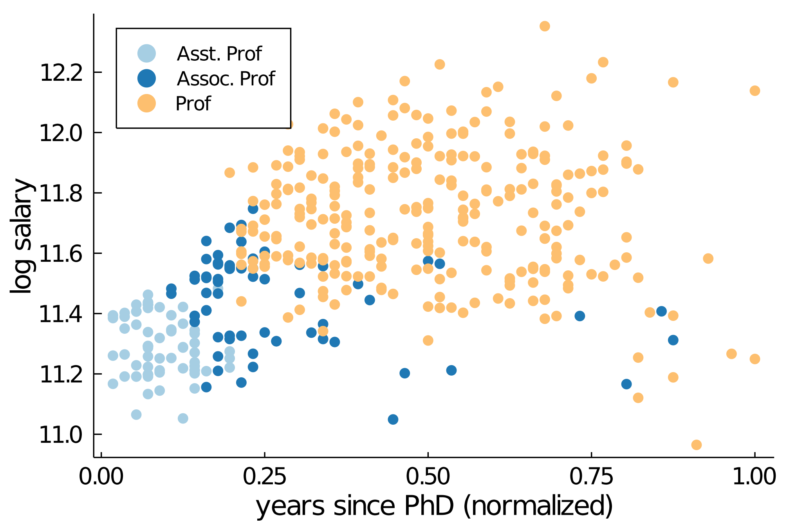

# Regressions- och tidsserieanalys, 7.5 hp

  
 


### Momentets innehåll

Regressionsanalys är en central statistisk metod som kan användas för att analysera samband mellan variabler och för att göra prediktioner. Regression används inom alla områden som arbetar med dataanalys, t ex inom empirisk samhällsvetenskap, ekonomi och finans, i analys av resultat från medicinska studier. Regression är också grunden för [maskininlärning](https://sv.wikipedia.org/wiki/Maskininl%C3%A4rning) och [artificiell intelligens](https://sv.wikipedia.org/wiki/Artificiell_intelligens). Funktionsformen för sambandet kan vara linjärt eller  icke-linjärt. Teorin för punktskattning,  intervallskattning  och  hypotesprövning  tillämpas  på  regressionsmodeller.  Kursen  presenterar  även  tekniker  för  att  upptäcka  avvikelser  från  modellens  antaganden,  och  konsekvenserna  av  modellavvikelser  för  den  statistiska  analysen  studeras.  

Data  som  har  insamlats  över  tid  är  vanligt  förekommande inom ett stort antal tillämpningsområden.  Kursen  presenterar  modeller  för  tidsserieanalys,  och  beskriver  hur  dessa  kan  användas  för  att  skapa  prognoser.  Praktiska tillämpningar av regressions- och tidsserieanalys diskuteras och exemplifieras genom hela kursmomentet.

### Kurslitteratur

* Andersson, G. Jorner, U. och Ågren, A. (2007). Regressions- och tidsserieanalys, Studentlitteratur. Boken förkortas **AJÅ** nedan.
* Ytterligare kompletterande material som delas ut under kursens gång. 

Kursens schema på TimeEdit: [Schedule](https://cloud.timeedit.net/su/web/stud1/s.html?i=x7ce6e5Z4n0wknyaQhxnZclQln_3nbZH05QcTcn_sl3516Qy6d685606y65060501ZWyQo#contentlinks).


### Föreläsningar

\
[Mattias Villani](https://mattiasvillani.com)<br>Professor i statistik

**Föreläsning 1 - Kursinformation. Introduktion till regressionsanalys och tidsserieanalys.**\
Läs: AJÅ Kapitel 1-2 | [Slides](https://github.com/mattiasvillani/Regression/raw/master/Slides/Regression_L1.pdf) \
Data: [cykeluthyrning](https://github.com/mattiasvillani/Regression/raw/master/Data/cykeluthyr.csv) | [myntauktioner](https://github.com/mattiasvillani/Regression/raw/master/Data/eBayDataUCI.csv) | [inflation](https://github.com/mattiasvillani/Regression/raw/master/Data/InflationReporanta.csv)

**Föreläsning 2 - Enkel linjär regression: Skattningar, residualer, OLS, ANOVA, förklaringsgrad, korrelation.**\
Läs: AJÅ Kapitel 2 | [Slides](https://github.com/mattiasvillani/Regression/raw/master/Slides/Regression_L2.pdf)\
Data: [hälsobudget](https://github.com/mattiasvillani/Regression/raw/master/Data/healthdata.csv)\
Extramaterial: [Kalkylark för beräkning av residualer - hälsobudget](https://github.com/mattiasvillani/Regression/raw/master/Misc/HealthdataResiduals.xlsx) | [Kalkylark för minstakvadratskattningar - hälsobudget](https://github.com/mattiasvillani/Regression/raw/master/Misc/HealthdataLeastSquares.xlsx) | [Video om regressionsanpassning](https://youtu.be/4FzeGcgCy0g) | [gif om regressionsanpassning](https://raw.githubusercontent.com/mattiasvillani/Regression/master/Misc/LeastSquares.gif)

**Föreläsning 3 - Enkel och Multipel regression: ANOVA, hypotestest, förklaringsgrad, korrelation.**\
Läs: AJÅ Kapitel 2-3 | [Slides](https://github.com/mattiasvillani/Regression/raw/master/Slides/Regression_L3.pdf)\
Extramaterial: [gif om samplingfördelningen för minsta kvadratestimatorn](https://raw.githubusercontent.com/mattiasvillani/Regression/master/Misc/LeastSquaresSampDist.gif) | [gif om samplingfördelningen skattning av regressionslinje](https://raw.githubusercontent.com/mattiasvillani/Regression/master/Misc/LeastSquaresSampDistRegLine.gif) 

**Föreläsning 4 - Multipel regression: Estimation, inferens, regularisering**\
Läs: AJÅ Kapitel 3 | [Slides](https://github.com/mattiasvillani/Regression/raw/master/Slides/Regression_L4.pdf)\
Kod: [SAS kod för regression på cykeluthyrningsdata](https://github.com/mattiasvillani/Regression/raw/master/Code/cykeluthyrning.sas) | [SAS kod för att simulera regressionsdata](https://github.com/mattiasvillani/Regression/raw/master/Code/simdatareg.sas)

**Föreläsning 5 - Multipel regression: Modellantaganden, modellkontroll och modellutvärdering**\
Läs: AJÅ Kapitel 3 | [Slides](https://github.com/mattiasvillani/Regression/raw/master/Slides/Regression_L5.pdf) 

**Föreläsning 6 - Enkel/Multipel regression (sammanfattning)**\
Läs: AJÅ Kapitel 2-3 | [Slides](https://github.com/mattiasvillani/Regression/raw/master/Slides/Regression_L6.pdf) | [Excelfil för analys av carsdata](https://github.com/mattiasvillani/Regression/raw/master/Misc/CarsSimpleReg.xlsx)\
Datamaterial: [cars](https://github.com/mattiasvillani/Regression/raw/master/Data/cars.csv)\
Extramaterial: [gif om bias när man missar att inkludera en förklarande variabel](https://raw.githubusercontent.com/mattiasvillani/Regression/master/Misc/omitted_var_bias.gif)

**Föreläsning 7 - Icke-linjär regression. Polynomsamband och exponentiella samband. Regularisering.**\
Läs: AJÅ Kapitel 4 (ej 4.4) | [Slides](https://github.com/mattiasvillani/Regression/raw/master/Slides/Regression_L7.pdf) \
Datamaterial: [salaries](https://github.com/mattiasvillani/Regression/raw/master/Data/salaries.csv) | [BNP-tillväxt Kina](https://github.com/mattiasvillani/Regression/raw/master/Data/china_gdp.csv)

**Föreläsning 8 - Tidsserieanalys. Komponenter. Säsongsrensning med glidande medelvärden.**\
Läs: AJÅ Kapitel 5 | [Slides](https://github.com/mattiasvillani/Regression/raw/master/Slides/Regression_L8.pdf)\
Datamaterial: [airpassengers](https://github.com/mattiasvillani/Regression/raw/master/Data/airpassenger.csv)  | [global temperature](https://github.com/mattiasvillani/Regression/raw/master/Data/globaltemp.csv)\
Extramaterial: [Excelfil för komponentsuppdelning av airpassengers data](https://github.com/mattiasvillani/Regression/raw/master/Misc/airlineDecomp.xlsx)


**Föreläsning 9 - Tidsserieanalys. Säsongsrensning med hjälp av regressionsanalys.**\
Läs: AJÅ Kapitel 5 | [Slides](https://github.com/mattiasvillani/Regression/raw/master/Slides/Regression_L9.pdf) 

**Föreläsning 10 - Autokorrelation. Autoregressiva modeller för tidsserier.**\
Läs: AJÅ Kapitel 6.4 och 6.8 | [Slides](https://github.com/mattiasvillani/Regression/raw/master/Slides/Regression_L10.pdf)\
Kod: [SAS kod för att skatta AR modeller för svensk inflation](https://github.com/mattiasvillani/Regression/raw/master/Code/inflAR.sas)

**Föreläsning 11 - Logistisk regression.**\
Läs: [Slides](https://github.com/mattiasvillani/Regression/raw/master/Slides/Regression_L11.pdf)\
Extraläsning: [Kapitel 10.5 i boken "Från datainsamling till rapport" av Karin Dahmström](https://www.studentlitteratur.se/kurslitteratur/matematik-och-statistik/statistik/fran-datainsamling-till-rapport/#Inneh%C3%A5llsf%C3%B6rteckning)\
Datamaterial: [Wisconsin breast cancer](https://github.com/mattiasvillani/Regression/raw/master/Data/breastcancer.csv)

**Föreläsning 12 - Genomgång av en övningstentamen.**\
Läs: Övningstentamen på Athena.

### Det statistiska programmeringsspråket R

Kursen använder det mycket populära statistiska programmeringsspråket R. Programmet är helt gratis och kan laddas ner på alla datorer. 
Du kan ladda ner R [här](https://ftp.acc.umu.se/mirror/CRAN/).

R är lättast att jobba i från programmet RStudio. RStudio är en slags arbetsmiljö byggd kring R. 
RStudio är gratis och kan ladda ner [här](https://www.rstudio.com/products/rstudio/download/#download).
Det finns en massa bra videos och tutorials för R och RStudio. [Här](https://youtu.be/FIrsOBy5k58) är t ex en kort video som ge en rundtur i RStudio.

Kursen har ett eget R paket med några datamaterial som används på kursen.
Paketet innehåller också några hjälpfunktioner som kan vara praktiska. 
För att kunna använda paketet behöver du installera det:
```
# För att installera kurspaketet regkurs
install.packages("remotes") # görs bara en gång på din dator
library(remotes)  
install_github("StatisticsSU/regkurs") # görs bara en gång på din dator
library(regkurs)

# För en lista med alla funktioner och datamaterial i paketet
help(, "regkurs")

# För information om ett specifikt datamaterial eller funktion i kurspaketet
?namnet_på_datamaterialet
?namnet_på_funktionen
```
